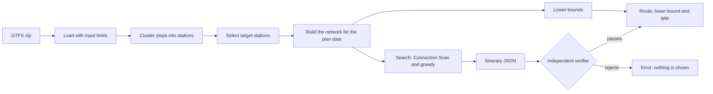

# allstops

**Plan the fastest way to visit every station of a metro network, from any
GTFS timetable, and know how good the plan is.**

allstops computes timetable-feasible routes for the *station challenge*:
travelling to every station of a transit network as fast as possible. It is the
sport behind the London Tube Challenge, with recorded attempts for Munich,
Berlin, New York and many other networks. Every route is replayed against the
raw timetable by an independent verifier before it is shown, and every result
comes with a lower bound, a time that no route under the same rules can beat.

> **Status: early development. Stage 0 of 6 (feasibility) is complete.** The
> command-line tool can fetch and profile a feed, build stations, plan a first
> route, verify it and bound it. Route optimisation, exports, the browser
> planner and the live run mode are on the [roadmap](#roadmap).

## Highlights

- **Any GTFS feed.** Feeds are loaded from memory with no network or file
  access in the core, so the same engine can later run in the browser.
- **Independently verified.** The verifier shares no code with the solver
  except feed loading (a test enforces it). It re-derives every boarding,
  transfer, walk and visit from the raw `stop_times.txt` rows and rejects the
  route with a coded violation if anything is off. Nothing unverified is
  shown.
- **Honest about quality.** Each result reports its lower bound and the gap.
  The word "optimal" is reserved for a gap of zero.
- **Safe with untrusted input.** Hard limits on archive size, decompressed
  size, entries, rows and line length stop zip bombs, and malformed data is
  reported as an error with the file and line. Fuzz-style tests push mutated
  feeds through the whole data pipeline to check that nothing crashes.
- **Reproducible.** Feeds are pinned by SHA-256, rules are saved with every
  result, and ties are broken deterministically.
- **Private.** No accounts, no telemetry. The CLI only goes online when you run
  `fetch`.

## Example: Munich U-Bahn

The Munich U-Bahn has 96 stations (MVG counts 100 by listing its four two-level
interchanges twice; see [docs/RULES.md](docs/RULES.md#the-munich-station-count-96-or-100)).

```console
$ allstops solve data/cache/mvv.gtfs.zip --rules data/rules/mvv-ubahn.toml --date 2026-11-12 --out route.json
feed loaded in 592 ms; network for 2026-11-12 built in 90 ms: 42258 trips, 778688 connections, 8987 stations, 88842 walk links, 96 targets
wrote route.json
Greedy route, 2026-11-12
  total time       4:29:10
  first visit      Oberwiesenfeld at 06:10
  last visit       Garching, Forschungszentrum at 10:39
  legs             18 rides, 2 walks
  changes          17 (10 tight: under 120 s to spare beyond the minimum change; least 0 s)
    tight: 72 s spare at Klinikum Großhadern after a walk
    tight: 80 s spare at Sendlinger Tor
    tight: 0 s spare at Neuperlach Süd
    tight: 80 s spare at Laimer Platz
    tight: 50 s spare at Hauptbahnhof (U, Tram)
    tight: 40 s spare at Olympia-Einkaufszentrum
    tight: 20 s spare at Moosach
    tight: 110 s spare at Hauptbahnhof (U, Tram)
    tight: 20 s spare at Mangfallplatz
    tight: 40 s spare at Dietlindenstraße
  lower bound      2:46:30 (gap 61.7%)
    static         2:18:25 (108 ms)
    profile        2:46:30 (10219 ms)
  greedy runs      1152 (1152 covered every target) in 312 ms
  verified against the raw timetable
Times are service-day clock times (may exceed 24:00).
Timetable data: Münchner Verkehrs- und Tarifverbund GmbH (MVV), CC BY 4.0, retrieved 2026-10-06, feed version 20261005
Planned from the published timetable. Real trains run late. Check official sources and ride safely.
```

The first steps of that route, from `route.json`:

| Step | Time | From | Line | Until | New stations | Visited |
|---|---|---|---|---|---|---|
| 1 | 06:10 | Oberwiesenfeld | U3 towards Fürstenried West | 06:41 Fürstenried West | +22 | 22 |
| 2 | 06:47 | Fürstenried West | 56 towards Schloss Blutenburg | 06:53 Max-Lebsche-Platz |  | 22 |
| 3 | 06:53 | Max-Lebsche-Platz | walk 142 m | 06:55 Klinikum Großhadern |  | 22 |
| 4 | 06:57 | Klinikum Großhadern | U6 towards Garching, Forschungszentrum | 07:12 Sendlinger Tor | +7 | 29 |
| 5 | 07:14 | Sendlinger Tor | U2 towards Messestadt Ost | 07:34 Messestadt Ost | +13 | 42 |
| 6 | 07:40 | Messestadt Ost | U2 towards Feldmoching | 07:50 Innsbrucker Ring |  | 42 |
| 7 | 07:54 | Innsbrucker Ring | U5 towards Neuperlach Süd | 08:02 Neuperlach Süd | +5 | 47 |
| 8 | 08:03 | Neuperlach Süd | U5 towards Laimer Platz | 08:29 Laimer Platz | +11 | 58 |

The full itinerary has 20 steps and ends at 10:39; every step lists the stations it ticks off.

<sub>Timetable data: Münchner Verkehrs- und Tarifverbund GmbH (MVV), CC BY 4.0,
feed version 20261005. Planned from the published timetable; real trains run
late.</sub>

## Quick start

Requires Rust 1.88 or newer (developed with 1.93).

```bash
git clone https://github.com/Waiivyy/allstops.git
cd allstops
cargo build --release
```

Then fetch the Munich feed, plan a route and check it independently:

```bash
./target/release/allstops fetch mvv
./target/release/allstops inspect data/cache/mvv.gtfs.zip
./target/release/allstops solve data/cache/mvv.gtfs.zip --rules data/rules/mvv-ubahn.toml --date 2026-11-12 --out route.json
./target/release/allstops verify data/cache/mvv.gtfs.zip route.json --rules data/rules/mvv-ubahn.toml
```

The plan date must lie inside the feed's validity range, which `inspect`
prints. MVV replaces its feed every few weeks. When the published file no
longer matches the pinned hash, `fetch` stops and shows the old and new
validity dates; rerun it with `--accept-new-hash` to adopt the new file and
choose a date inside its range.

## How it works



1. **Stations.** GTFS stops are clustered into the stations a passenger would
   name, using `parent_station`, German DHID station IDs, and names within a
   distance. Every count and visit works on stations.
2. **Network.** Trips of every service day that reaches into the time window
   are placed on one time line, with exact offsets across daylight-saving
   changes. Walk links join nearby stations under the walking rules, and
   `transfers.txt` minimums lengthen changes and walks where they apply.
3. **Search.** A [Connection Scan](https://arxiv.org/abs/1703.05997) engine
   finds the earliest time each station can be visited, aboard a train that
   stops there or by boarding one. A greedy heuristic repeatedly travels to the
   unvisited target that can be visited first, from every target station and
   several start times, and keeps the shortest route.
4. **Verification.** The route is written as a versioned JSON itinerary that
   names trips and stops by their GTFS IDs, then checked by `allstops-verify`.
5. **Bounds.** Two relaxations of the visiting order, solved with Held-Karp
   1-trees: one on fastest static travel times, one on the least time from any
   visit of a station to the earliest reachable visit of another, computed with
   backward profile scans. Both are checked against an exhaustive search on
   small networks: 800 in every test run and 10,000 in a long run.

Details and proof sketches: [docs/ALGORITHMS.md](docs/ALGORITHMS.md).
Design decisions and the measurements behind them:
[docs/DESIGN.md](docs/DESIGN.md).

## Results

### Munich U-Bahn (96 stations)

Measured with `cargo xtask bench` (Apple M5, 10 cores; single-threaded release build; MVV feed version 20261005; default rules):

| Plan date | Best planned route | Lower bound | Gap | Verified | Changes | Walking |
|---|---|---|---|---|---|---|
| Mon 2026-11-09 | 4:26:40 | 2:46:30 | 60.2% | yes | 14 | 142 m |
| Thu 2026-11-12 | 4:29:10 | 2:46:30 | 61.7% | yes | 17 | 190 m |
| Sat 2026-11-14 | 4:45:50 | 2:44:45 | 73.5% | yes | 15 | 296 m |

These are first routes from the greedy heuristic, and the bound is still loose: it relaxes the order in which stations are visited and lets each pair of consecutive stations use its best-aligned connection of the day (see [docs/ALGORITHMS.md](docs/ALGORITHMS.md#lower-bounds)). Route optimisation and stronger bounds are Stage 3.

**Planned versus achieved.** The Guinness World Records time for visiting all Munich U-Bahn stations is 4 h 19 min 21 s, achieved by Lorenz Wünsch and Till Rasche on 21 April 2022 from Garching-Forschungszentrum to Messestadt Ost. The times above are plans on the November 2026 timetable under the default rules: scheduled times without delays, walking and never running, a 60-second minimum change, and trams, buses and the S-Bahn as connectors. A plan is not a record, and the two numbers are not directly comparable.

### Synthetic networks

The benchmark also generates seeded networks with branches, rings, shared trunks, walk links and connector buses: 200 tiny ones (3 to 7 stations, solved exactly by exhaustive search) and 50 small ones (15 to 30 stations).

| | Tiny | Small |
|---|---|---|
| Routes passing the verifier | 200 / 200 | 50 / 50 |
| Greedy route equals the exact optimum | 125 / 200 | n/a |
| Lower bound at most the exact optimum | 200 / 200 | n/a |
| Mean gap, greedy to exact optimum | 8.9% | n/a |

Full tables, timings and caveats: [eval/RESULTS.md](eval/RESULTS.md).

## Commands

| Command | What it does |
|---|---|
| `allstops fetch <id>` | Download a registered feed over HTTPS and check its pinned SHA-256 |
| `allstops inspect <zip>` | Feed profile: validity, structure, warnings, date coverage |
| `allstops stations <zip>` | Cluster stops into stations; list a selection's targets |
| `allstops solve <zip> --rules <toml>` | Plan a route, verify it, report the lower bound and gap |
| `allstops verify <zip> <itinerary.json> --rules <toml>` | Check any itinerary against the raw feed and the given rules |

Every command accepts `--json` for machine-readable output. Exit codes: `0`
success; `1` no feasible route, or an itinerary rejected by the verifier; `2`
usage, data or runtime error.

## Rules

A run is planned and checked under explicit rules, saved with every result.
The defaults for Munich (`data/rules/mvv-ubahn.toml`):

- A station counts as visited when a U-Bahn train you are on stops there, or
  when you board one there. You do not need to get off. Passing through without
  a scheduled stop does not count, and neither does walking past.
- Trams and buses may be used to move between stations but never count as
  visits. (In the MVV feed the S-Bahn is coded as tram, so it is allowed too.)
- Walks of up to 1,200 m straight-line distance, at an assumed 4.5 km/h with a
  detour factor of 1.3 and at least 2 minutes each; never two walks in a row.
- At least 60 seconds to change trains at a station. Changes with less than
  2 minutes to spare beyond that are flagged as tight.
- `transfers.txt` is honoured as the GTFS reference defines it: minimum times
  are kept, forbidden transfers are never used.
- Time runs from the first visit to the last, between 04:30 and 26:00 of the
  plan date's service day.

Walking speed, detour factor and transfer buffers are assumptions, not
measurements. [docs/RULES.md](docs/RULES.md) defines every option and compares
them with the published Guinness World Records guidelines.

## Testing and benchmarks

```bash
cargo test                                   # unit, property and mutation tests
cargo test -p allstops-gtfs -- --ignored     # snapshot test against the pinned MVV feed
cargo xtask bench                            # synthetic and real networks, writes eval/RESULTS.md
```

- **Routing** is checked against a separate brute-force oracle (Dijkstra over
  explicit states) on random networks, including hops that take no time; a
  long run of 100,000 networks agrees, deliberately broken variants are caught,
  and an independent RAPTOR implementation gives identical labels.
- **The verifier** has mutation tests: a valid itinerary passes, and each
  single mutation (a departure too soon after an arrival, a wrong service date,
  a trip that does not call at the alighting stop, boarding where pickup is not
  allowed, a walk faster than the rules allow, a forbidden transfer, a missing
  station, overlapping legs) is rejected with the expected code.
- **Bounds** are asserted to be at most the exact optimum, found by exhaustive
  search, on every small synthetic network in the benchmark.
- **Untrusted input** tests cover truncated archives, zip bombs, archives with
  too many entries, oversized lines, invalid UTF-8, missing columns, malformed
  times, skipped calendar dates and mutated feeds (run in debug builds, so
  integer overflows would also fail).

Also available: `cargo xtask routing` (Connection Scan against RAPTOR),
`cargo xtask parse` (GTFS loaders), `cargo xtask pack` (serialisation formats)
and `cargo xtask bound-tuning`.

## Project layout

| Path | Contents |
|---|---|
| `crates/allstops-gtfs` | Feed loading with limits, calendars, station clustering, selection, network building |
| `crates/allstops-core` | Network model, Connection Scan, profile scans, plans, lower bounds, itinerary schema, rules |
| `crates/allstops-verify` | The independent verifier |
| `crates/allstops-cli` | The `allstops` command-line tool |
| `xtask` | Benchmarks, synthetic network generator, experiments |
| `data` | Feed registry, rules and selections (no timetable data) |
| `docs` | Rules, data notes, algorithms, design decisions |
| `eval` | Benchmark specification and latest results |

## Roadmap

| Stage | Scope | Status |
|---|---|---|
| 0 | Data profiling, feasibility spike, benchmark harness, design, review | done |
| 1 | Data layer: overrides, footpaths with measured walks, deterministic network packs | planned |
| 2 | Routing and verifier: profile queries, larger property suites against a time-expanded oracle | planned |
| 3 | Solver: corridor decomposition, stronger bounds, local search, robustness, replanning, exports | planned |
| 4 | Web planner: the engine in WebAssembly, map replay, prebuilt packs | planned |
| 5 | Live run mode: offline phone view, "missed it" replanning, more cities | planned |
| 6 | Releases, CI, documentation | planned |

## FAQ

**Is this the optimal route?** Not yet. Stage 0 plans with a greedy heuristic,
and the reported gap to the lower bound is large. A route is only called
optimal when its gap is zero.

**Why was my real run slower than the plan?** The plan assumes every train runs
exactly to the published timetable, that each change takes the assumed buffer
and that you walk at the assumed speed. Real trains run late, platforms can be
far apart, and crowds slow you down.

**Can I use my own city?** Any GTFS feed within the input limits loads and can
be inspected and clustered today. A city needs a selection file that names its
target mode (for example `route_types = [1]` for a metro) and a rules file.
Adding a feed to the registry needs its licence checked first; see
[docs/DATA.md](docs/DATA.md).

**Does it use live delays?** No. Plans come from the published timetable only.
Live data is a stretch goal.

## Related work

- Beckenbach, Borndörfer, Knoben, Kretz and Uetz,
  [*The S-Bahn Challenge in Berlin*](https://opus4.kobv.de/opus4-zib/frontdoor/index/index/docId/5379),
  ZIB-Report 15-13, 2015: a periodic space-time network turned into a
  travelling-salesman problem.
- E. Rappos, [*Tubechallenges: Can OR help break records?*](https://optimization-online.org/2005/04/1112/),
  2005: an integer-programming model of the London challenge.
- G. Laporte, *The Tube Challenge*, INFOR 52(1), 2014: formulations as
  travelling-salesman and postman problems.
- [vats5](https://github.com/marcia-pedals/vats5) plans exact or bounded routes
  from GTFS for several configured systems, including Munich.
- Many single-city projects exist, mostly for New York and London.

## Safety

Planned from the published timetable. Real trains run late. Check official
sources and ride safely. No route requires running. Follow station rules, do
not run on platforms, stairs or escalators, and travel with a valid ticket.

A planned time is not a record and does not predict one. Comparisons with
records here are always planned versus achieved.

## Data and attribution

No timetable data is stored in this repository. Feeds are downloaded from
their publishers and used under their licences, listed in
[data/feeds.toml](data/feeds.toml), [NOTICE](NOTICE) and
[docs/DATA.md](docs/DATA.md). Every itinerary carries its feed's attribution.

Munich: Timetable data: Münchner Verkehrs- und Tarifverbund GmbH (MVV), CC BY
4.0.

No operator or record-keeping organisation is affiliated with or endorses this
project.

## Licence

Licensed under either of [Apache License 2.0](LICENSE-APACHE) or
[MIT licence](LICENSE-MIT), at your option.
